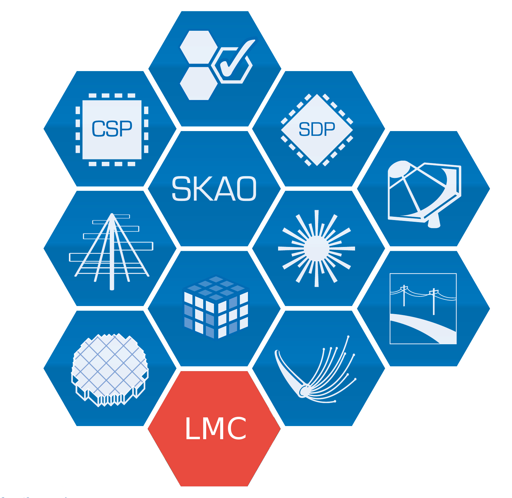

# LMC-prototypes
Repository for SKA LMC prototypes code and documentation, for harmonization effort
<p align="center">
  
</p>

# SKA LMC - Preliminary

## **About**  
This is the monitoring and control (M&C) repository for the Square
Kilometer Array (SKA) harmonization effort.

## **Installation**  
Install the project dependencies:  
* omniORB [http://omniorb.sourceforge.net/]  
* zmq [http://zeromq.org/]  
* log4cpp [http://http://log4cpp.sourceforge.net/]  
* Tango Control System [http://www.tango-controls.org/]  
  
Make sure you have set the following environment variables to the external library installation dirs 
* TANGO_ROOT  
* OMNIORB_ROOT  
* ZMQ_ROOT  

(Optional) Add also the following paths to the PKG_CONFIG_PATH environment var: 
* $TANGO_ROOT/lib/pkgconfig  
* $OMNIORB_ROOT/lib/pkgconfig  
* $ZMQ_ROOT/lib/pkgconfig  
* $LOG4CXX_ROOT/lib/pkgconfig  


Clone this repository into your local $SOURCE_DIR  
  ```git clone https://github.com/SKA-PreConstruction/LMC-prototypes.git $SOURCE_DIR```
